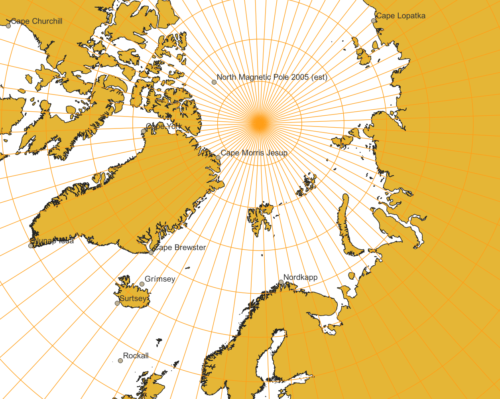

# 1. Desember
Nissen planlegger sin reise til alle snille utviklere på julaften. Han drar opp Kommunekart og søker opp Nordpolen. Til sin forskrekkelse får han NULL treff. Han prøver sin favorittkoordinat 90N, 45E uten hell. Hvor havner han? Er alt han har trodd på hele livet en løgn? Hvorfor sier Mercator at hjemmet hans er uendelig? 

Julenissen har truffet på et klassisk GIS-problem: Projeksjoner. Verden er dessverre ikke flat - men rund. Skjermen og de fleste websider er flate. Derfor må vi projisere fra en kule til en 2D-flate. De fleste webkart bruker "Web Mercator" som har EPSG-koden 3857. "GPS-koordinater" er sfæriske/kulekoordinater og har grader fra Nord (N) og Øst (E). Som ekte GIS-utvikler kjenner du alltid til: 
* 3857 - webprojeksjonen
* 4326 - "GPS-koordinater"/Latlng
* 25833 - UTM33 i Euref89 - Norske standarden
* 32633 - UTM33 i WGS84 - Norske standarden men "eldre globus"

Nyttige linker med mer om projeksjoner:
* GeoForum - Norsk veiledning på projeksjoner: https://github.com/GeoForum/veiledning05
* GeoForum - Intro til projeksjoner - https://github.com/GeoForum/veiledning05/blob/master/docs/projeksjoner.md
* https://epsg.io/
* Kartverket - kartprojeksjoner https://www.kartverket.no/til-lands/posisjon/kartprojeksjonar
* Kartverket - transformasjon: https://www.kartverket.no/til-lands/posisjon/transformere-koordinater 
* Projeksjoner i D3 https://observablehq.com/@d3/projection-transitions
* https://docs.mapbox.com/mapbox-gl-js/guides/projections/
* https://docs.qgis.org/3.22/en/docs/gentle_gis_introduction/coordinate_reference_systems.html

Oppgaven i dag:
---------------
Julenissen er desorientert og savner et kart med Nordpolen i sentrum. 
1. Hvilken projeksjon egner seg? 
1. Lag et kart hvor julenissen kan kjenne igjen verden fra sitt perspektiv (nordpolen).

Datasett:

* Graticules: https://www.naturalearthdata.com/downloads/110m-physical-vectors/110m-graticules/
* Land areas: https://www.naturalearthdata.com/downloads/10m-physical-vectors/
* Labels: https://www.naturalearthdata.com/downloads/50m-physical-vectors/50m-physical-labels/

Tips til software:
* QGIS Desktop (https://qgis.org/)
* Leaflet og Proj4Leaflet (https://kartena.github.io/Proj4Leaflet/)
* Mapbox.js (https://docs.mapbox.com/mapbox-gl-js/api/map/)
* OpenLayers (http://openlayers.org/)