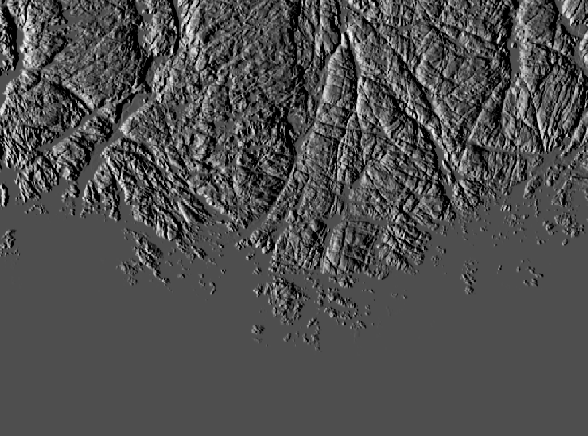
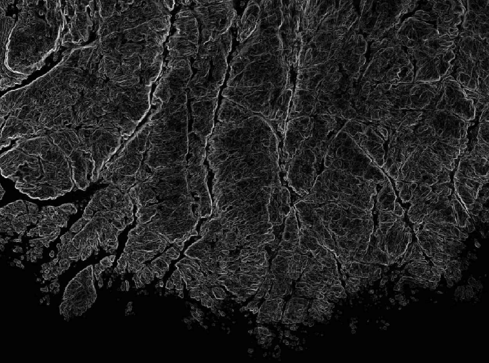

# 12. Desember
Wow! Julenissen har ikke antiskrens på sleden. Han trenger å finne ut hvor det er sinnsyke skrenter. Så vil han gjerne ha et oversikts-terrengkart som viser terrenget på en enkel måte. 

GIS er ikke bare GeoJSON-filer og LatLng. Vi skiller mellom _raster_ og _vektor_ som to store datatyper. Rasterdata er grid-data; ofte bilder, høydedata, satellittdata. Enkelt forklart er det celler i en matrise hvor hver celle har en verdi. Vektordata er matematisk definerte geometrier som består av punkt, linje, flate. Det finnes tusenvis av algoritmer for å behandle rasterdata og gjøre avanserte analyser. Ofte blir dette brukt i terrenganalyser og på satellittdata / Earth Observation. 

Nyttige linker med mer om raster og vektordata:
* https://gisgeography.com/spatial-data-types-vector-raster/
* https://docs.qgis.org/3.22/en/docs/gentle_gis_introduction/index.html

Oppgaven i dag:
---------------
Julenissen trenger karthjelp til sledekjøring 
1. Lag et hillshade-kart over et valgfritt område du vil Julenissen skal besøke
1. Lag et slope-kart som viser skrenter så ikke sleden havner i uføre

Datasett:
* Digital terrengmodell DTM50 som GeoTIFF: [6400_50m_33.tif](./6400_50m_33.tif)
* [GeoNorge DTM10](https://kartkatalog.geonorge.no/metadata/dtm-10-terrengmodell-utm33/dddbb667-1303-4ac5-8640-7ec04c0e3918)
* https://e-torg.no/ for detaljerte 3D-modeller for proffbrukere 

Tips til software:
* QGIS Desktop (https://qgis.org/)
* GDAL (installeres med QGIS i 'osgeo4w shell') https://gdal.org/programs/gdaldem.html
